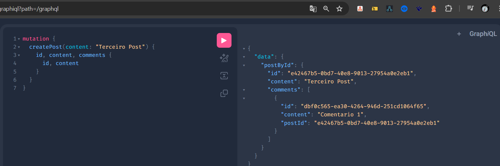
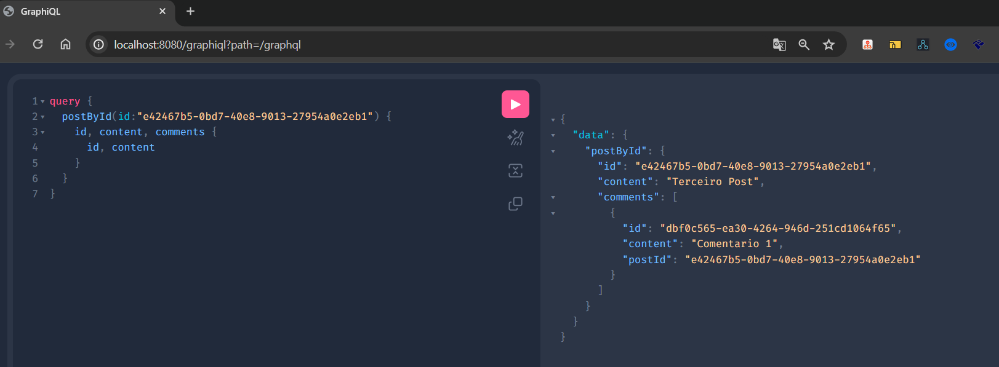
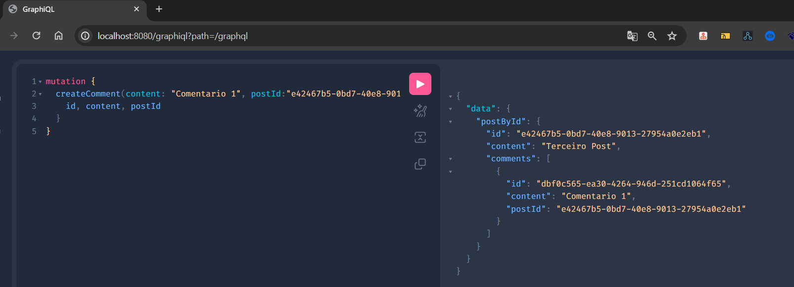
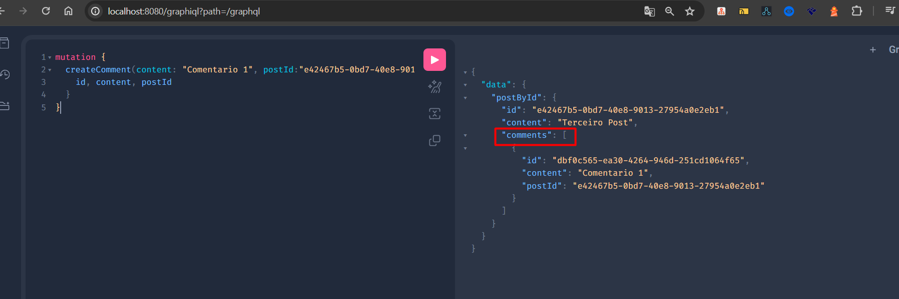

# Tutorial Graphql Api [](https://www.linkedin.com/in/annarafaeladev/)

## Start
* git clone https://github.com/annarafaeladev/tutorial-graphql-api.git

### Referencias 
* [Spring Initializer](https://start.spring.io/)
* [Spring Web](https://docs.spring.io/spring-boot/docs/3.2.5/reference/htmlsingle/index.html#web)
* [Spring for GraphQL](https://docs.spring.io/spring-boot/docs/3.2.5/reference/htmlsingle/index.html#web.graphql)
* [Testing](https://docs.spring.io/spring-boot/docs/2.1.13.RELEASE/reference/html/boot-features-testing.html)

### Config

* adicionar a seguinte configuração no ``application.properties`` para habilitar graphql: ``spring.graphql.graphiql.enabled=true``


### Testar Local
* Rodar o projeto, abrir  uma aba no navegador e ```http://localhost:8080/graphiql``` desse modo abri o console do graphql para executar as querys

### Testes Unitários
* spring-boot-starter-test

A biblioteca `spring-boot-starter-test` fornece suporte para escrever e executar testes de unidade e integração em aplicativos Spring Boot. Ele inclui várias bibliotecas de teste populares, como JUnit, Mockito e AssertJ, pré-configuradas para uso em testes Spring Boot: 
````
<dependency>
    <groupId>org.springframework.boot</groupId>
    <artifactId>spring-boot-starter-test</artifactId>
    <scope>test</scope>
</dependency>
````

### Instalação

Para usar `spring-boot-starter-test` em seu projeto, adicione a seguinte dependência ao seu arquivo `pom.xml` (para projetos Maven)
### Estrutura
A lógica consiste em criar posts em um forum, e relacionar comentário a ele. A persistencia de dados foi realizada em mémoria apenas para nivel educacional.

Existe 3 endpoints
* Criação de post
  

  
* Buscar post pelo id



* Criar comentário



* Carregar os comentario de cada post
  * foi criado um data loader para que isso seja realizado automatico no controller com o mesmo nome definido no schema ```comments```
  * ```
    @SchemaMapping
    public Collection<Comment> comments (Post post) {
        return commentService.findByPost(post.id());
    }
  



